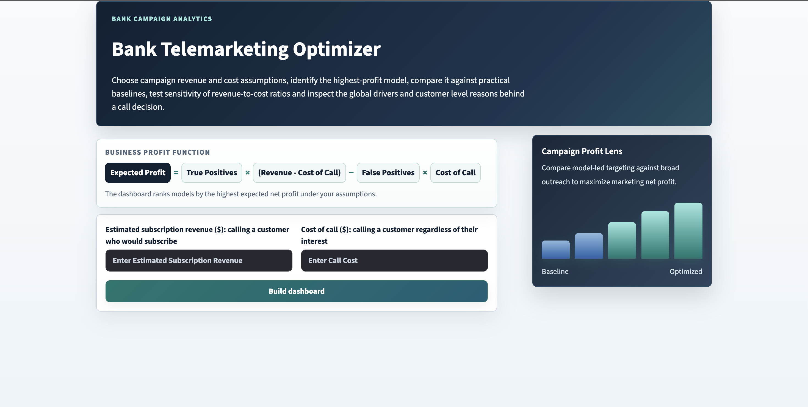

# 📊 Bank Telemarketing Optimizer
 
An end-to-end machine learning project that helps bank marketing teams decide **which customers to call** for a term deposit subscription campaign — maximising profit rather than just accuracy.
 
The project trains multiple classifiers, evaluates them through a **profit-based framework** (not just accuracy), and surfaces everything in an interactive **Streamlit dashboard** with SHAP-powered explainability and an AI chatbot assistant.

Watch the demo below:
[](https://youtu.be/qwfQaNthQoQ)
---

## Table of Contents

- [Project Overview](#project-overview)
- [Repository Structure](#repository-structure)
- [Prerequisites](#prerequisites)
- [Installation](#installation)
- [Running the Project](#running-the-project)
- [Performance & Caching](#performance--caching)
- [Configuration](#configuration)
- [Key Concepts](#key-concepts)

---

## Project Overview

Traditional marketing models optimise for classification accuracy, which is misleading on imbalanced datasets. Additionally, they often fail to take into account the inherent asymmetric cost. This project frames the problem as a **profit optimisation** problem:
 
- **False Positive** → a wasted call 
- **False Negative** → a missed subscription opportunity 

Models are evaluated and ranked by **expected profit** at an optimally-chosen threshold, and results are explored interactively in the dashboard.

---

## Repository Structure

```
bank-telemarketing-optimizer/
│
├── README.md                        ← You are here
├── requirements.txt                 ← Python dependencies
│
├── Images/
│   └── screenshots/                 ← Dashboard screenshots for this README
│
├── Data/
│   └── bank_telemarketing.csv       ← Source dataset (see Data Setup)
│
├── Models/                          ← Pre-trained model artefacts (committed to repo)
│   ├── dashboard_model_metadata.json
│   └── *.joblib                     ← Fitted model files
│
├── Code/
│   ├── README.md                    ← Code module documentation
│   ├── app.py                       ← Streamlit dashboard entry point
│   ├── chatbot.py                   ← AI chatbot (HuggingFace-powered)
│   ├── dashboard_pipeline.py        ← Core ML pipeline & business logic
│   ├── dashboard_visuals.py         ← Plotly / Matplotlib chart builders
│   ├── evaluation.py                ← Custom asymmetric F-beta scorer
│   ├── ml.py                        ← Model definitions & training functions
│   ├── preprocessing.py             ← Data cleaning & feature engineering
│   └── train_dashboard_models.py    ← CLI script to re-train all models
│
└── eda.ipynb                        ← Exploratory Data Analysis notebook
```

---

## Prerequisites

- Python **3.9 – 3.12**
- `pip` (comes with Python)
- A HuggingFace account + free API token *(optional — only needed for the chatbot)*

---

## Installation

### 1. Clone the repository

```bash
git clone https://github.com/dphyy/Bank_Telemarketing_Optimizer.git
cd Bank-Telemarketing-Optimizer
```

### 2. Create and activate a virtual environment *(recommended)*

```bash
python -m venv .venv

# macOS / Linux
source .venv/bin/activate

# Windows
.venv\Scripts\activate
```

### 3. Install dependencies

```bash
pip install -r requirements.txt
```

---

## Running the Project
 
Pre-trained model artefacts are committed to the `Models/` folder, so the dashboard loads instantly with no training step required.
 
### Launch the dashboard
 
From the **repository root**, run:
 
```bash
streamlit run Code/app.py
```
 
The dashboard will open in your browser. All models and SHAP computations are loaded from cached artefacts — no waiting for training.
 
### Re-train models from scratch *(optional)*
 
Only needed if you change the data, features, or cost parameters:
 
```bash
python Code/train_dashboard_models.py
```
 
This overwrites the artefacts in `Models/`. Commit the updated files if you want to share the new results.
```

### Exploratory Data Analysis
 
```bash
jupyter notebook eda.ipynb
```

---

## Performance & Caching
 
The dashboard is optimised to feel instant after cloning:
 
| What is cached | Where | Benefit |
|---|---|---|
| **Fitted models** | `Models/*.joblib` | Dashboard skips all training on startup |
| **Model metadata & thresholds** | `Models/dashboard_model_metadata.json` | Profit metrics and optimal thresholds are pre-computed |
| **SHAP values** | Computed once per session and held in `st.session_state` | Switching between SHAP tabs or features doesn't recompute |
| **Preprocessor** | Saved alongside each model in the `.joblib` bundle | Single-customer and batch scoring work without reloading data |
 
If you modify any model, preprocessing logic, or cost parameters, re-run `train_dashboard_models.py` and commit the updated `Models/` folder to restore the fast-load behaviour.
 
---

## Configuration

### Chatbot (optional)

The built-in AI assistant uses the [HuggingFace Inference API](https://huggingface.co/inference-api). To enable it:

1. Create a free token with read access at <https://huggingface.co/settings/tokens>.
2. Open `Code/chatbot.py` and replace the placeholder:

```python
HF_TOKEN = "hf_YOUR_TOKEN_HERE"
```

The default model is `Qwen/Qwen2.5-7B-Instruct`. You can swap it by editing `HF_CHAT_MODEL` in the same file. The chatbot is scoped to project-related questions only.

### Cost Parameters

The asymmetric cost ratio that drives hyperparameter tuning is defined in `Code/ml.py`:

```python
cost_fp = 1   # Cost of a wasted call (false positive)
cost_fn = 4   # Cost of a missed subscription (false negative)
```

Changing these values and re-running `train_dashboard_models.py` will shift which set of hyperparameters are recommended.

---

## Key Concepts

| Term | Meaning |
|------|---------|
| **F-beta score** | Weighted F-score where beta = √(cost_fn / cost_fp), balancing precision and recall asymmetrically |
| **Expected profit** | Profit = TP × revenue − FP × call_cost, evaluated at the optimal classification threshold |
| **SMOTE** | Synthetic Minority Over-sampling — applied to training data only to handle class imbalance |
| **SHAP** | SHapley Additive exPlanations — model-agnostic feature importance used for explainability |
| **Cost sensitivity** | Analysis showing how each model's profitability changes across different revenue-to-cost ratios |

